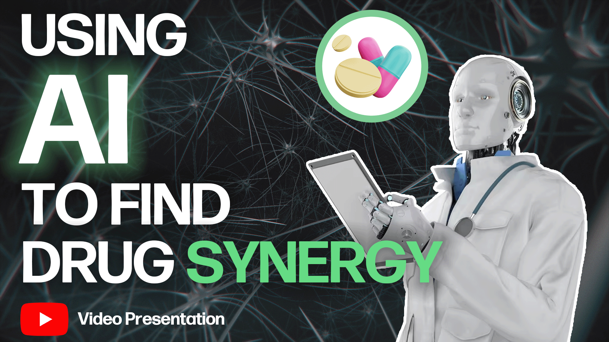

# 🧬 Synergy Transfer

**Synergy Transfer** is a deep learning model that can predict synergies between various drugs to aid in cancer research.

> [!NOTE]
> This project is an attempt to reproduce the results from the paper **"Anti-Cancer Drug Synergy Prediction in Understudied Tissues Using Transfer Learning"** by [Kim et al. (2020)](https://doi.org/10.1101/2020.02.05.932657). Most of the original code has been reused, with only necessary modifications made to resolve dependency issues and perform ablation studies. 

The original publication can be accessed [here](https://academic.oup.com/jamia/article-abstract/28/1/42/5920819?redirectedFrom=fulltext&login=false). And the original publication GitHub repoitory can be accessed [here](https://github.com/yejinjkim/synergy-transfer). 

<a href="https://www.youtube.com/watch?v=viN0ZtUBl_g">
<div align="center">
    
</div>

## 🎯 Purpose

A significant challenge faced in the drug discovery for cancer research is the uneven distribution of data for particular types of cancers and tissues. [Kim et al. (2020)](https://doi.org/10.1101/2020.02.05.932657) present a novel solution using a deep neural network that uses transfer learning to learn from the abundance of examples within data-rich tissues and enhance predictions in data-poor tissues.

## 🚀  Usage

### Step 1: Clone this Repository

First you need to clone this repo to your local machine. The instructions below are adapted from [GitHub's documentation](https://docs.github.com/en/repositories/creating-and-managing-repositories/cloning-a-repository) on cloning repositories; for more information, please refer to the [docs](https://docs.github.com/en).

<details><summary><b>Show instructions</b></summary>

1. Navigate to the main page of the repository.

2. Above the list of files, click **<> Code**.

3. Copy the URL for the repository.
    - To clone the repository using HTTPS, under "HTTPS", click **Copy**.

4. Open Git Bash.

5. Change the current working directory to the location where you want the cloned repository. e.g.
    ```
    cd path/to/folder
    ```

6. Type `git clone`, and then paste the URL you copied earlier, e.g.
    ```
    git clone https://github.com/blakepm2/synergy_transfer
    ```

7. Press **Enter** to create your local clone.

</details>

### Step 2: Set up your environment

After cloning the repository, you need to set up your environment in order to run the code. Ubuntu 22.04 is recommended for this.

#### 2.1 Install Conda

First, install Conda as shown below, you can refer to more comprehensive instructions on [Conda's website](https://docs.conda.io/projects/conda/en/latest/user-guide/install/linux.html) if you're using a different OS.

```
mkdir -p ~/miniconda3
wget https://repo.anaconda.com/miniconda/Miniconda3-latest-Linux-x86_64.sh -O ~/miniconda3/miniconda.sh
bash ~/miniconda3/miniconda.sh -b -u -p ~/miniconda3
rm -rf ~/miniconda3/miniconda.sh
```

Then initialize bash and zsh shells

```
~/miniconda3/bin/conda init bash
~/miniconda3/bin/conda init zsh
```

Create a new conda environment using Python 3.8 as the base. To make things easier, you can use the following command to create a new conda environment using the [environment.yaml](environment.yaml) file, as shown below:

```
conda env create -f environment.yaml
```

Or, if you wish to do it yourself, create your new conda environment as shown below:

```
conda create -n synergy python=3.8
```

and activate it

```
conda activate synergy
```

#### 2.2 Install Python Dependencies

With a conda environment successfully configured, you now must install all of the required Python dependencies.

```
pip install torch torchvision
pip install cudatoolkit==12.1
pip install pandas
pip install scikit-learn
pip install seaborn
pip install numpy
pip install matplotlib
pip install rdkit
```

At this point you should be all set up to start running the code in this notebook. Ensure you select the conda environment you created as the Kernel.

### Step 3: Download the data

Next, you need to download the data in order to train the models. For simplicity, you can use this script to download the data directly from Google Drive. This folder includes both the raw and processed data, as well as pretrained models.

```
import gdown

DATA_PATH = 'downloaded_data/'

gdown.download_folder('https://drive.google.com/drive/u/1/folders/14xZ4BLGMEO0Wv5uY0R2tMtB13hevjVLF', output=DATA_PATH, quiet=False)
```

### Step 4: Run `final.ipynb`

After completing the steps listed above, you should be ready to go and can choose to reprocess the raw data and train the model for yourself, or you can instead load the pretrained models as needed.

## 📖 References

[1]: Chen, X. (2002). TTD: Therapeutic target database. Nucleic Acids Research, 30(1), 412–415. https://doi.org/10.1093/nar/30.1.412 

[2]: HMS LINCS (Harvard Medical School). LINCS MCF 10A Common Project: Rolling-timepoint sensitivity measures of the MCF 10A breast cell line to 8 small molecule perturbagens. Dataset 8 of 15: End-point dose-response metrics for biological replicate 2. http://lincsportal.ccs.miami.edu/datasets/#/view/LDS-1415. Published 2017.

[3]: Kim, Y., Zheng, S., Tang, J., Zheng, W. J., Li, Z., & Jiang, X. (2020). Anti-Cancer Drug Synergy Prediction in Understudied Tissues Using Transfer Learning. https://doi.org/10.1101/2020.02.05.932657 

[4]: Liu, S., Nie, W., Wang, C., Lu, J., Qiao, Z., Liu, L., Tang, J., Xiao, C., & Anandkumar, A. (2023). Multi-modal Molecule structure–text model for text-based retrieval and editing. Nature Machine Intelligence, 5(12), 1447–1457. https://doi.org/10.1038/s42256-023-00759-6

[5]: Wishart, D. S., Knox, C., Guo, A. C., Cheng, D., Shrivastava, S., Tzur, D., Gautam, B., & Hassanali, M. (2007). Drugbank: A Knowledgebase for drugs, drug actions and drug targets. Nucleic Acids Research, 36(suppl_1). https://doi.org/10.1093/nar/gkm958 

[6]: Zagidullin, B., Aldahdooh, J., Zheng, S., Wang, W., Wang, Y., Saad, J., Malyutina, A., Jafari, M., Tanoli, Z., Pessia, A., & Tang, J. (2019). Drugcomb: An integrative cancer drug combination data portal. Nucleic Acids Research, 47(W1). https://doi.org/10.1093/nar/gkz337 


